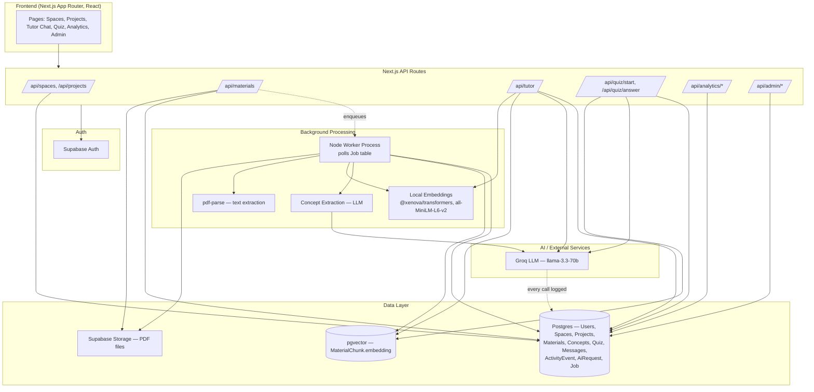

# Architecture Documentation — AI Study Companion

## System Diagram

## Layer responsibilities

- **Frontend**: Next.js App Router pages, client components using `fetch` against our own API routes. No separate frontend framework/repo — one deployable unit.
- **API layer**: Next.js Route Handlers. Every route re-verifies ownership server-side (`assertProjectOwnership`) rather than trusting client-supplied IDs — this is the actual enforcement point for data isolation (PRD §52).
- **Auth**: Supabase Auth (email/password). `src/lib/auth.ts` bridges the Supabase auth user to our own `User` table on every request, which is also where the "first user becomes admin" prototype convenience lives.
- **Data layer**: Single Postgres database (via Supabase) with the `vector` extension enabled, so retrieval doesn't require a second database system. Prisma is the ORM; raw SQL is used only for the two operations Prisma can't express (vector similarity search, vector column writes).
- **Background processing**: A polled `Job` table instead of Redis/BullMQ — see trade-off note below. A separate Node process (`npm run worker`) handles PDF text extraction, chunking, local embedding generation, and concept extraction.
- **AI layer**: All LLM calls go through `src/lib/llm.ts`, which is also where every call gets logged to `AiRequest` for observability — this was built in from the start rather than bolted on, so there was never a code path that could skip logging.

## Key architectural decisions & trade-offs

| Decision | Why | Trade-off accepted |
|---|---|---|
| Single Postgres + pgvector instead of a dedicated vector DB | One connection string, one system to provision and reason about for a 3-4 day build | Won't scale to millions of vectors as gracefully as Pinecone/Weaviate — acceptable at prototype data volume |
| Local embeddings (`@xenova/transformers`) instead of a hosted embeddings API | Zero additional cost, zero additional API key/rate limit to manage | Slower per-call, smaller/lower-quality embedding space than e.g. OpenAI's `text-embedding-3-large` |
| Polled `Job` table instead of Redis/BullMQ | No second piece of infrastructure to provision; still demonstrates the queued→processing→done/failed pattern with retries | Not horizontally scalable; a missed poll cycle costs up to 3 seconds of latency, acceptable for this use case |
| Groq (`llama-3.3-70b-versatile`) for all generation | Fast inference, already used successfully in a prior project | Smaller model than GPT-4-class — reasoning depth on complex open-ended grading is good but not top-tier |
| Fixed similarity threshold (0.35) for "supported vs unsupported" | Simple, explainable gate to implement PRD §20 without a tuning pass | Not adaptive — a real system would calibrate this against labeled examples |
| Mastery via exponential moving update (0.7 old + 0.3 new) instead of a real IRT/Bayesian model | Understandable, cheap to compute, matches PRD §29's explicit "not perfect measurement" framing | Doesn't account for question difficulty in the update itself, only in selection |

## What was intentionally simplified because of the timeline

- OCR for scanned/image-only PDFs — not implemented; such files fail cleanly with a clear error rather than silently producing empty output.
- No sophisticated retry/dead-letter infrastructure for background jobs — a capped retry (3 attempts) is implemented, which demonstrates the pattern without building a full job-orchestration system.
- No RLS (Row Level Security) policies configured on the Supabase tables — isolation is enforced entirely at the application layer via ownership checks in every API route, since the app always uses the service-role key server-side. Documented explicitly as a known limitation, not an oversight.
- Frontend styling is minimal/functional rather than polished — time was allocated to making every listed feature actually work end-to-end rather than visual design.
